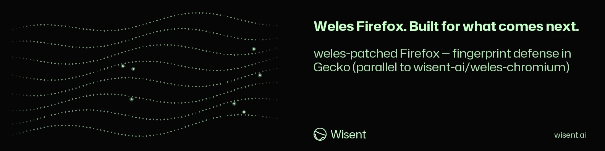

<!-- wisent-banner:start -->
<p align="center">
  
</p>
<!-- wisent-banner:end -->

<!-- wisent-readme-signals:start -->
[](https://github.com/wisent-ai/weles-firefox) [](https://github.com/wisent-ai/weles-firefox/issues) [](https://wisent.com) [](https://discord.gg/qRjpkthq54) [](https://www.linkedin.com/company/wisent-ai/) [](https://x.com/wisentai) [](https://calendly.com/lbartoszcze)
<!-- wisent-readme-signals:end -->

# Patches for Firefox for the Weles AI Undetectable Browser Use Ecosystem

Published Firefox Artifact for Browser Use and Instructions How to Cook It.

This repository carries the Firefox patches, build instructions, verification,
and artifact-publishing process used by Weles. It is parallel to
[`wisent-ai/weles-chromium`](https://github.com/wisent-ai/weles-chromium).

This repository is the source of truth for the Gecko delta, its declared
capabilities, and the candidate-release contract. It does not vendor the
Firefox source tree or generated build output. A build uses a separate
`mozilla-central/` checkout pinned to the declared fork point.

## Upstream base

| | |
|---|---|
| Upstream version | **142.0a1** |
| Fork point | `5836a062` |
| Activation | `weles.fingerprint.*` preferences |

Update `browser-capabilities.json`, this table, and the patch series together
when rebasing onto a newer Firefox revision.

## What the patches do

The repository carries five patches:

| Patch | Surface | Gecko file |
|---|---|---|
| `0001-weles-prefs-register.patch` | Registers the `weles.fingerprint.*` preferences | `modules/libpref/init/all.js` |
| `0002-weles-navigator-webdriver.patch` | Overrides `navigator.webdriver` when explicitly configured | `dom/base/Navigator.cpp` |
| `0003-weles-webgl-vendor-renderer.patch` | Supplies configured WebGL vendor and renderer values | `dom/canvas/ClientWebGLContext.cpp` |
| `0004-weles-nsScreen-overrides.patch` | Supplies configured screen and available-screen geometry | `dom/base/nsScreen.cpp` |
| `0005-weles-window-outer-overrides.patch` | Supplies configured outer-window geometry and screen position | `dom/base/nsGlobalWindowOuter.cpp` |

The overrides are opt-in. Weles supplies the matching preferences for an
authorized browser session; an unconfigured build retains Firefox's normal
values. `browser-capabilities.json` is the machine-readable declaration used
by the release process.

## Repository layout

```text
patches/                    Reviewable Gecko patch series
browser-capabilities.json   Versioned capability declaration
scripts/build.sh            Idempotent patch application and Firefox build
scripts/verify.mjs          Post-build surface verification
scripts/release.sh          Candidate packaging and publication
.github/workflows/release.yml
                            Candidate attestation and Weles dispatch
```

## Build

Building Firefox requires the Mozilla toolchain and a large Gecko checkout.
Keep that generated checkout at `mozilla-central/`; it is intentionally
excluded from this repository.

```sh
git clone --filter=blob:none https://github.com/mozilla/gecko-dev.git mozilla-central
git -C mozilla-central checkout 5836a062
bash scripts/build.sh
```

`scripts/build.sh` applies every patch once, bootstraps the Mozilla toolchain
when needed, and runs `mach build`. Use `bash scripts/build.sh --no-build` to
prepare and check patch application without compiling Firefox.

Build output:

```text
mozilla-central/obj-weles/dist/Nightly.app/Contents/MacOS/firefox  # macOS
mozilla-central/obj-weles/dist/bin/firefox                          # Linux
```

## Verify a build

```sh
node scripts/verify.mjs
```

The verifier launches the built browser against a loopback page and checks
`navigator.webdriver`, WebGL identity, screen geometry, and outer-window
geometry against explicit Weles preference values.

## Publish a candidate

```sh
bash scripts/release.sh
```

The authenticated GitHub actor must appear in the repository's
`WELES_RELEASE_APPROVERS` variable, and tracked release inputs must match
`HEAD`. The script packages the current platform build and publishes an
immutable prerelease candidate containing:

- the Firefox archive and SHA-256 checksum;
- `browser-capabilities.json`;
- source revision, patch-tree identity, platform, and entrypoint metadata.

The release workflow binds the declared bytes to the source revision, creates
a portable Sigstore attestation, and dispatches the candidate to Weles.
Production promotion must reuse those exact bytes after Probierz evidence is
bound to their digest.

## Consumption by Weles

Weles installs the promoted archive through its Stado release path under:

```text
~/.local/share/weles-firefox/<version>-weles.N/
└── Firefox.app/Contents/MacOS/firefox
```

Linux archives contain `firefox/firefox` instead. Weles launches only the
deployment-selected version whose checksum and local release receipt match;
absence or mismatch fails closed.

## Security and authorization

This source code does not authorize automation of any target. Weles workflows
remain bound to explicit origins, actions, credentials, and operator policy.
Report vulnerabilities through a
[private GitHub Security Advisory](https://github.com/wisent-ai/weles-firefox/security/advisories/new).
